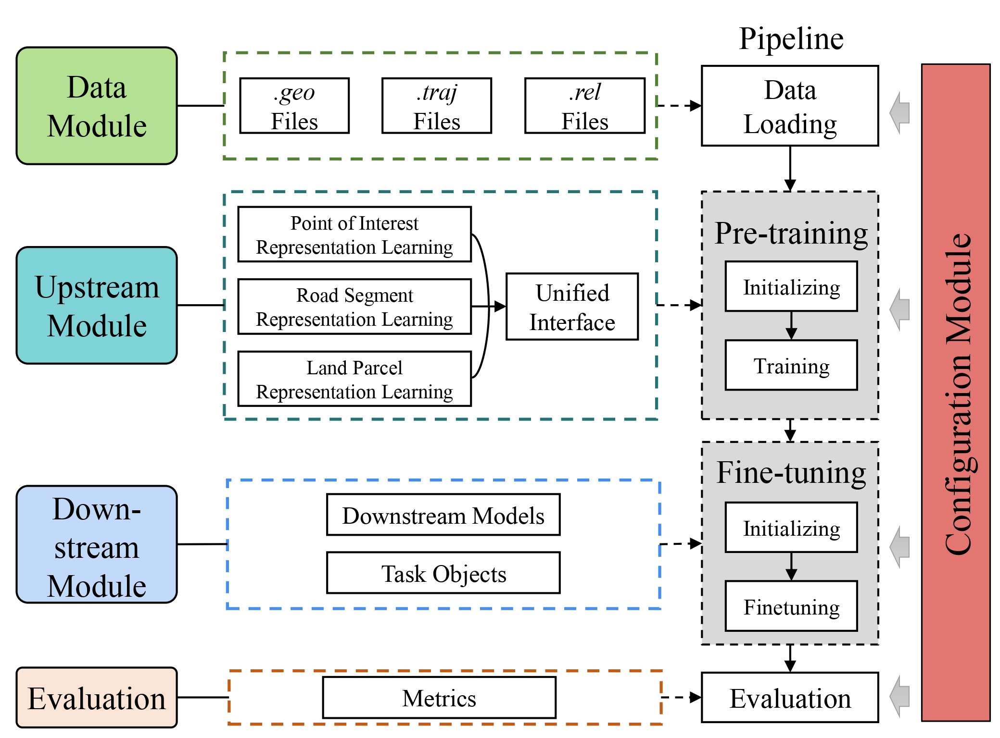

<div align="center">
    
    <p> 
    	<b>
        A Taxonomy-guided Library for Map Entity Representation Learning
        </b>
    </p>

------

<p align="center">
  <a href="#1-overview">Overview</a> •
  <a href="#2-quick-starting">Quick Starting</a> •
  <a href="#3-dataset-illstration">Dataset Illstration</a> •
  <a href="#4-how-to-run">How to Run</a> •
  <a href="#5-directory-structure">Directory Structure</a> •
  <a href="#6-citation">Citation</a> •
  <a href="https://arxiv.org/abs/2411.00874" title="arxiv">arXiv</a>
</p>
</div>

Official repository of under review paper "*VecCity*: A Taxonomy-guided Library for Map Entity Representation Learning". Please star, watch, and fork our repo for the active updates!

## News
- We launched a new interface that supports standard input formats. More details see this [link](https://github.com/Bigscity-VecCity/VecCity/tree/main/data_transfer).
- We added HGI, ReDCL, HAFusion, and TrajRNE to our library. 

## Coming Soon:
1. We are adding JGRM, R2Vec, CatEM, and CAPE to further enhance our library.
2. New tasks, such as land usage analysis and crime prediction, will also be introduced.

## 1. Overview
<div align="center">
  
</div>

*VecCity* is an open-sourced and standardized benchmark compatible with various datasets and baseline models. The above figure illustrates the arcitecture of VecCity. 
For a given dataset, we first construct atomic files from multi-sourced city data by extracting and mapping entities (e.g., POIs, road segments, land parcels, etc.) and auxiliary data into corresponding atomic files. 
MapRL models encodes various entities in a unified configuration, which facilitates joint processing for various downstream tasks.

### Supported Models

| Model    | Target Entity | Category    | Run Args  | Ref                        |
|----------|---------------|-------------|-----------|----------------------------|
| SkipG  | POI            | Token-based | --task poi --model SkipGram  | [Mikolov et al., arXiv 2013](https://arxiv.org/abs/1301.3781) |
| Tale   | POI            | Token-based |--task poi --model Tale      | [Wan et al., TKDE 2022](https://ieeexplore.ieee.org/document/9351627)      |
| Teaser | POI            | Token-based |--task poi --model Teaser    | [Zhao et al., WWW 2017](https://dl.acm.org/doi/10.1145/3041021.3054138)      |
| Hier   | POI            | Seq-based   |--task poi --model Hier      | [Shimizu et al., SIGSPATIAL 2020](https://dl.acm.org/doi/10.1145/3397536.3422229) |
| P2Vec  | POI            | Token-based |--task poi --model POI2Vec   | [Feng et al., AAAI 2022](https://ojs.aaai.org/index.php/AAAI/article/view/10500)     |
| CACSR  | POI            | Seq-based   |--task poi --model CACSR     | [Gong et al., AAAI 2023](https://dl.acm.org/doi/10.1609/aaai.v37i4.25546)     |
| CTLE   | POI            | Seq-based   |--task poi --model CTLE      | [Lin et al., AAAI 2022](https://ojs.aaai.org/index.php/AAAI/article/view/16548)      |
| RN2Vec | Segment        | Token-based |--task segment --model RN2Vec    | [Wang et al., TIST 2021](https://dl.acm.org/doi/10.1145/3424346)     |
| HRNR   | Segment        | Graph-based |--task segment --model HRNR      | [Wu et al., KDD 2020](https://dl.acm.org/doi/10.1145/3394486.3403043)        |
| SARN   | Segment        | Graph-based |--task segment --model SARN      | [Chang et al., EDBT 2023](https://openproceedings.org/2023/conf/edbt/paper-193.pdf)            |
| Toast  | Segment        | Seq-based   |--task segment --model Toast     | [Chen et al., CIKM 2021](https://dl.acm.org/doi/abs/10.1145/3459637.3482293)     |
| HRoad  | Segment        | Graph-based |--task segment --model HyperRoad | [Zhang et al.,TKDD 2023](https://dl.acm.org/doi/full/10.1145/3592859)                         |
| START  | Segment        | Seq-based   |--task segment --model START     | [Jiang et al.,ICDE 2023](https://ieeexplore.ieee.org/document/10184736)         |
| JCLRNT | Segment        | Seq-based   |--task segment --model JCLRNT    | [Mao et al., CIKM 2022](https://dl.acm.org/doi/10.1145/3511808.3557370)      |
| TrajRNE  | Segment        | Graph-based   |--task segment --model TrajRNE     | [Jiang et al., PAKDD 2023](https://link.springer.com/chapter/10.1007/978-3-031-33383-5_5)         |
| ZEMob  | Parcel         | Token-based |--task parcel --model ZEMob     | [Yao et al., IJCAI 2018](https://www.ijcai.org/proceedings/2018/545)     |
| GMEL  | Parcel         | Graph-based |--task parcel --model GMEL      | [Liu et al., AAAI 2020](https://ojs.aaai.org/index.php/AAAI/article/view/5425)      |
| MGFN   | Parcel         | Graph-based |--task parcel --model MGFN      | [Wu et al., AAAI 2023](https://ojs.aaai.org/index.php/AAAI/article/view/25112)               |
| HDGE   | Parcel         | Token-based |--task parcel --model HDGE      |[Wang et al., CIKM 2017](https://dl.acm.org/doi/10.1145/3132847.3133006)     |
| MVURE  | Parcel         | Graph-based |--task parcel --model MVURE     | [Zhang et al., IJCAI 2020](https://www.ijcai.org/proceedings/2020/0611.pdf)   |
| ReMVC  | Parcel         | Token-based |--task parcel --model ReMVC     | [Zhang et al.,TKDE 2022](https://dl.acm.org/doi/abs/10.1109/TKDE.2022.3220874)         |
| HGI   | Parcel         | Graph-based |--task parcel --model HGI      | [Huang et al., ISPRS 2023](https://www.sciencedirect.com/science/article/abs/pii/S0924271622003148)             |
| ReDCL   | Parcel         | Token-based |--task parcel --model ReDCL      | [Li et al., KDD 2023](https://dl.acm.org/doi/10.1145/3580305.3599538)             |
| HREP   | Parcel         | Graph-based |--task parcel --model HREP      | [Zhou et al., AAAI 2023](https://ojs.aaai.org/index.php/AAAI/article/view/25625)             |
| HAFus| Parcel         | Graph-based |--task parcel --model HAFusion      | [Zhou et al., ICDE 2024](https://ieeexplore.ieee.org/document/10597688)             |


## 2. Quick Starting
### Step 1: Create a Python 3.9 environment and install dependencies:

```
conda create -n VecCity python=3.9
source activate VecCity
```


### Step 2: Install library:

```bash
pip install -r ./requirements.txt
```

### Step 3: Download processed data:

You can also follow the instructions to download processed city data from [bhpan](https://bhpan.buaa.edu.cn/link/AA904DB8317D61423995CA009146E0AF33), [Google Drive](https://drive.google.com/file/d/1JqnGsprG2zpJ4tisf0o3liOLy3GR7t0i/view?usp=drive_link) or process your own dataset.

### Step 4: Run a training pipeline for MapRL models:

```
python run_model.py --task poi --dataset nyc --model CTLE --exp_id CTLE 
```

## 3. Dataset Illustration
We open-source nine city datasets in New York, Chicago, Tokyo, San Francisco, Porto, Beijing, Chengdu, and Xi'an compatible with atomic files. 
As the original dataset is quite large, we have included example data, data processing code, and model code to assist researchers in understanding our work. 
The complete data sources can be found on [Beihang Pan](https://bhpan.buaa.edu.cn/link/AA904DB8317D61423995CA009146E0AF33) or [Google Drive](https://drive.google.com/file/d/1JqnGsprG2zpJ4tisf0o3liOLy3GR7t0i/view?usp=drive_link).

The above dataset construction scheme is highly reusable, one can prepare their own city data and use our code to build their personalized MapRL dataset easily. 
We will provide a detailed explanation of our data and pre-processing module in the following. 

#### 3.1 City Data

| City | #POI  | #Segment | #Parcel | #CIT | #CDT  | #OD|
| :-- | --: | --: | --: | --: | --: | --: |
| NY  | 79,627 | 90,781  | 262    | 823,853  | -         | 28,189 |
| CHI | 28,141 | 47,669  | 77     | 279,183  | -         | 4,631  |
| TYO | 61,858 | 407,905 | 64     | 573,703  | 226,782   | -      |
| SIN | 75,329 | 35,084  | 332    | 827,828  | 11,170    | -      |
| PRT | 4,521  | 11,095  | 382    | 19,402   | 695,085   | 324    |
| SF  | 15,674 | 27,274  | 194    | 171,873  | 500,516   | 24,716 |
| BJ  | 81,181 | 40,306  | 11,208 | -        | 1,018,312 | 687,890|
| CD  | 17,301 | 6,195   | 1,306  | -        | 559,729   | 64,482 |
| XA  | 19,108 | 5,269   | 1,056  | -        | 384,618   | 54,365 |

PS: "CIT" refers to the Check-in Trajectory, and "CDT" refers to the Coordinate Trajectory, which is derived from the GPS trajectory through map matching.

We store the original unprocessed files in the [Beihang Pan](https://bhpan.buaa.edu.cn/link/AA904DB8317D61423995CA009146E0AF33) or [Google Drive](https://drive.google.com/file/d/1JqnGsprG2zpJ4tisf0o3liOLy3GR7t0i/view?usp=drive_link) (You can find the detail of preprocess in README file which is placed in the city dataset dir).  After proprocessing, the original dataset will be storaged in atomic files.
Our city dataset construction scheme is highly reusable. You can prepare your own data following either the file format in *atomic files*. This flexibility allows you to adapt the construction process to various cities and datasets easily.


#### 3.2 Atomic files

The following types of atomic files are defined:

| filename    | content                                  | example                                  |
| ----------- | ---------------------------------------- | ---------------------------------------- |
| xxx.geo     | Each line in the file represents a map entity | geo_uid, type, geo_location, geo_features|
| xxx.grel     | Each line of the file records a non-zero geographic relation between two map entities. | rel_uid, ori_geo_id, des_geo_id, weight, feature, timestamp|
| xxx.srel     | Store the relationship information between entities, such as areas. | rel_uid, type, orig_geo_id, dest_geo_id,weight  |
| xxx.citraj    |  Each line of the file corresponds to a sample of a check-in trajectory. | traj_uid, sample_order, user_id, geo_id, time |
| xxx.cdtraj    | Each line of the file corresponds to a sample of a coordinate trajectory. | traj_uid, sample_order, user_id, geo_id, time |
| config.json | Used to store the config settings for data processing. |                                          |

we explain the above four atomic files as follows:

**xxx.geo**: An element in the entity table consists of the following four parts:

**geo_uid, geo_type, 'geo_location', geo_features(multiple columns).**

```
geo_uid: This field records the unique ID for map entities.
type: This field recodes the entity's type, of which the value can be ``point'', ``polyline'' or ``polygon'', corresponding to POIs, road segments, and land parcels.
geo_location: This field stores the geographical coordinates of a map entity: a single longitude and latitude for point entities, a sequence of coordinates for polylines, and a closed sequence of coordinates for polygons.
geo_features (optional): This field stores the features of a map entity, with the format and length of this field varying based on the data type and number of features.
```

**xxx.grel or xxx.srel**: An element in the relationship table consists of the following six parts:

**rel_uid, orig_geo_id, dest_geo_id, wight, feature(multiple columns), time.**

```
rel_uid: This field records the unique ID for a relationship between two map entities.
ori_geo_uid & des_geo_uid: These two fields indicate the uIDs of the origin and destination map entities of a relation, with values matching the geo_uid listed in the *.geo* file.
wight (optional): This field recodes the weight of the edge corresponding to a map entity relation.
feature (optional): This field stores additional features for a relation network edge. In some MapRL models, relation networks are modeled as heterogeneous graphs. This field can be used to store the type of heterogeneous edges. 
time (optional): This field stores timestamps for a relation and is essential for dynamic graphs, where edge weights and features correspond to the edge state during a specific time period.
```

**xxx.citraj or xxx.cdtraj**: An element in the trajectory table consists of the following four parts:

**traj_uid, sample_order, user_id, geo_id, time, vflag**.

```
traj_uid: The field specifies the unique ID of a trajectory that samples belong to.
sample_order: The field records the order index of a sample within a trajectory.
user_id: The field indicates the user who generates this record.
geo_id: The field indicates the map entity to which a sample corresponds, with its value matching the *geo_uid* of the map entity listed in the *.geo* file.
timestamp: The field stores a trajectory sample's timestamp, which is in the format of Unix timestamps.
vflag (optional): whether the taxi has passengers.
```

**config.json**: The config file is used to supplement the settings for data preprocessing.


## 4. How to Run

#### 4.1 Train a MapRL Model

To train and evaluate a MapRL model, use the run_model.py script:

```bash
python ./run_model.py 
  -h, --help            show this help message and exit
  --task TASK           the name of task [poi, segment,parcel]
  --model MODEL         the name of the model
  --dataset DATASET     the name of the dataset [nyc, tyo, chi, sin, sf, prt, bj, cd, xa]
  --config_file CONFIG_FILE
                        the file name of the config file
  --saved_model SAVED_MODEL
                        whether save the trained model
  --train TRAIN         whether re-train model if the model is trained before
  --exp_id EXP_ID       id of experiment
  --seed SEED           random seed
  --save_result SAVE_RESULT
                        save the result or not
  --gpu GPU             whether use gpu
  --gpu_id GPU_ID       the GPU id to use
  --batch_size BATCH_SIZE
                        the batch size
  --learning_rate LEARNING_RATE
                        learning rate
  --max_epoch MAX_EPOCH
                        the maximum epoch
  --executor EXECUTOR   the executor class name
  --evaluator EVALUATOR
                        the evaluator class name

```
**How to get the embedding?**

We storage the embedding file in **./veccity/cache/[exp_id]/evaluate_cache/[map entity]_embedding.csv**.

#### 4.2 Evaluate your map entity embedding with VecCity

To train and evaluate a MapRL model on downstream tasks, use the run_model.py script:

```bash
python run_model.py --task poi --model CTLE --dataset nyc --exp_id [exp_id] --train false
```
This script will run the CTLE model on the nyc dataset for downstream tasks of the poi entity under the default configuration.

## 5 Directory Structure

The expected structure of files is:
```
VecCity
 |-- VecCity 
 |    |-- cache
 |    |    |-- dataset_cache  # 中间文件
 |    |    |    |-- bj   
 |    |    |    |-- cd     
 |    |    |    |-- ...     
 |    |    |-- 98186  # indexed by exp_id
 |    |    |    |-- evaluate_cache # dir for evaluation result and entity embeddings    
 |    |    |    |-- model_cache # dir for model parameter        
 |    |-- config  # 
 |    |    |-- data # dir for data module configs
 |    |    |-- evaluator # dir for downstream & evaluation configs
 |    |    |-- executor # dir for pipeline configs
 |    |    |-- model # dir for model module configs
 |    |    |-- config_parser.py
 |    |    |-- task_config.json # management file for config
 |    |-- data  # dir for data module where stores the scrips for data loading
 |    |-- downstream  # dir for downstream module where stores the scripts for downstream models
 |    |-- executor  # dir for exector where stores the scripts of training process
 |    |-- pipeline  # dir for pipeline where stores the pipeline scripts
 |    |-- upstream  # dir for upstream module where stores the scripts for upstream models
 |    |-- utils  # dir for utils where stores the scripts of useful tools
 |-- raw_data
 |    |-- prt
 |    |    |-- prt.geo
 |    |    |-- prt.grel
 |    |    |-- prt.srel
 |    |    |-- prt.citraj
 |    |    |-- prt.cdtraj
 |    |    |-- config.json
 |    |-- ...
 |-- log  # dir for log
 |-- test
 |-- script # some examples for runing
 |-- run_model.py 
 |-- README.md
```

## 6 Citation
If you find our work is useful for your research, please consider citing:
```bash
@article{10.14778/3742728.3742749,
    author = {Zhang, Wentao and Wang, Jingyuan and Yang, Yifan and U, Leong Hou},
    title = {VecCity: A Taxonomy-Guided Library for Map Entity Representation Learning},
    year = {2025},
    publisher = {VLDB Endowment},
    volume = {18},
    number = {8},
    issn = {2150-8097},
    doi = {10.14778/3742728.3742749},
    journal = {Proceedings of the VLDB Endowment.},
    month = apr,
    pages = {2575–2588},
    numpages = {14}
}
```

## Supporters
[](https://github.com/Bigscity-VecCity/VecCity/stargazers)

[](https://github.com/Bigscity-VecCity/VecCity/network/members)
